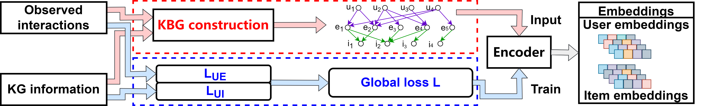

# From Extraction to Wedging: A New Knowledge-enhanced Framework for Recommendation
<!--#### -->
## Introduction

The combination of data- and knowledge-driven technologies have attracted much attention where present-day recommender system amounts to an exemplary case. 
Present-day recommender systems utilize side information, i.e., knowledge graph, to  facilitate the recommendation task. 
Current approaches employ collaborative knowledge graph (CKG) which connects items in a collaborative filtering model with the entities. 
However, there is no research on how to make full use of such knowledge in recommendation. 
In this paper, we study the criterion of utilizing knowledge in such models, discover a problem of previous methods, 
the ''ineffectual representation'' problem, and propose a new framework. 
First, we analyze the learning process of a knowledge-enhanced recommender model and discover $2$ desired properties for them, 
locally consistency and having indispensable entities. 
However, we find that for CKG-based model, the two properties are, in some sense, at odds with each other. 
This explains why in some cases, GNN may fail to make full use of the knowledge, which we call ''ineffectual representation''. 
Then, we propose a new framework integrating knowledge into data-driven learning, the knowledge-wedging framework (KWF) for recommendation. 
In KWF, to avoid ineffectual representation problem, 
we introduce  knowledge-bridged graph (KBG) which inserts entities as a bridge between users and items. 
We also introduce the Knowledge Refinement (KR) objective to capture the attributes’ attractiveness to provide reference for recommendation. 
Our experiments over $4$ real-world datasets demonstrate that KWF addresses the ineffectual representation phenomenon, 
captures the attributes’ attractiveness, while significantly improving existing models.


## Datasets

* [Amazon-book](http://jmcauley.ucsd.edu/data/amazon)

* [LastFM](https://grouplens.org/datasets/)

* [Yelp2018](https://www.yelp.com/dataset/challenge)

* [MovieLens](https://grouplens.org/datasets/movielens/)

## Requirements

* python >= 3.9

* torch>=1.7.0

* dgl>=0.7.0

* scikit-learn>=0.24.0


### Command and configurations

#### on Amazon-book
```bash
python -u main.py --model_type baseline  --dataset amazon-book --gpu_id 0 --ue_lambda 0.1 --idf_sampling 1 --layer_size [64,32,16] --embed_size 64 --lr 0.0001 --epoch 3000 --verbose 1 --save_flag 1 --pretrain -1 --batch_size 8192 --sprate 1
```
#### on LastFM
```bash
python -u main.py --model_type baseline --dataset last-fm --gpu_id 0 --ue_lambda 0.1 --idf_sampling 1 --layer_size [64,32,16] --embed_size 64 --lr 0.0001 --epoch 3000 --verbose 1 --save_flag 1 --pretrain -1 --batch_size 8192 --sprate 1
```
#### on Yelp2018
```bash
python -u main.py --model_type baseline --dataset yelp2018 --gpu_id 0 --ue_lambda 0.1 --idf_sampling 1 --layer_size [64,32,16] --embed_size 64 --lr 0.0001 --epoch 3000 --verbose 1 --save_flag 1 --pretrain -1 --batch_size 8192 --sprate 1
```
#### on MovieLens
```bash
python -u main.py --model_type baseline --dataset movie-lens --gpu_id 0 --ue_lambda 0.4 --idf_sampling 1 --layer_size [64,32,16] --embed_size 64 --lr 0.0001 --epoch 3000 --verbose 1 --save_flag 1 --pretrain -1 --batch_size 8192 --sprate 1
```
#### General flags

```{txt}
optional arguments:
  --dataset                       dataset                               
  --idf_sampling                  negative entity number
  --layer_size                    size of each layer
  --embed_size                    dimension of embedding vector 
  --epoch                         max epochs before stop
  --pretrain                      use pretrain or not
  --batch_size                    batch size
```